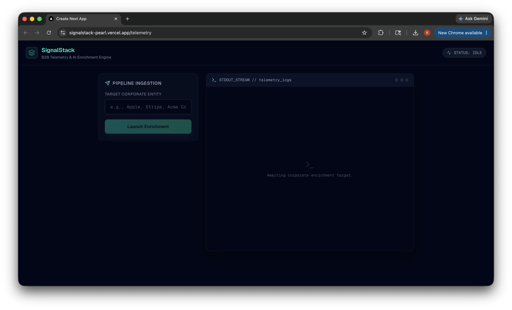
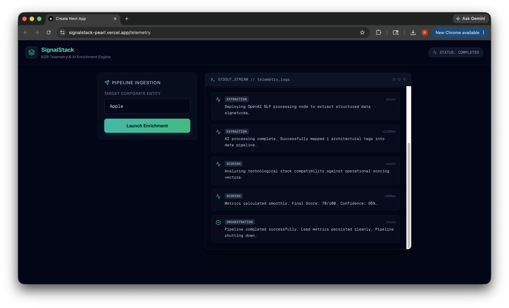

# SignalStack

**B2B lead enrichment pipeline with real-time observability** — submit a company name, get an AI-scored lead profile back, and watch every pipeline step stream live to a telemetry dashboard.

[](https://signalstack-pearl.vercel.app/telemetry)
[](https://nextjs.org/)
[](https://www.typescriptlang.org/)
[](https://supabase.com/)
[](https://openai.com/)

**Live demo:** [signalstack-pearl.vercel.app/telemetry](https://signalstack-pearl.vercel.app/telemetry)

---

## At a glance

| | |
|---|---|
| **Problem** | Sales teams spend hours manually researching prospects before outreach. |
| **Solution** | An async pipeline that researches a company, extracts structured signals with AI, scores the lead, and persists results — with full step-by-step visibility. |
| **Who it's for** | RevOps, SDR teams, and platform engineers building enrichment workflows. |
| **Project type** | Production-inspired portfolio demo — showcases async API design, structured AI output, and observability patterns. |

---

## Screenshots

**Telemetry dashboard** — submit a company and watch pipeline steps stream in real time:



**Successful pipeline run** — research → extraction → scoring → persistence:



---

## How it works

```
POST /api/enrich  { "company": "Acme Corp" }
        │
        ▼
  Ingestion (202 Accepted immediately)
        │
        ▼
  Background worker (Vercel waitUntil)
        │
        ├── Research   → gather company context
        ├── Extraction → OpenAI structured JSON parsing
        ├── Scoring    → deterministic lead score (0–100)
        └── Persist    → upsert to Supabase
        │
        ▼
  Telemetry logs written at every step → dashboard polls & displays
```

1. Client POSTs a company name to `/api/enrich`.
2. API creates a job record and returns `202 Accepted` with a `jobId` — no blocking on AI latency.
3. A background worker runs the multi-step pipeline via Vercel's `waitUntil`.
4. Each step writes to `pipeline_telemetry`; the dashboard polls Supabase and renders a live terminal UI.

Try it from the CLI:

```bash
curl -X POST https://signalstack-pearl.vercel.app/api/enrich \
  -H "Content-Type: application/json" \
  -d '{"company": "Stripe"}'
```

---

## Tech stack

| Layer | Technology |
|---|---|
| Frontend | Next.js 16, React 19, TypeScript, Tailwind CSS 4 |
| Backend | Next.js Route Handlers, Vercel Functions (`waitUntil`) |
| AI | OpenAI SDK — GPT-4o with JSON mode |
| Database | Supabase (PostgreSQL) |
| Deployment | Vercel |

---

## What this demonstrates

Useful signals for engineering and platform hiring:

- **Non-blocking async APIs** — instant `202` response while long-running work continues in the background
- **Structured AI integration** — schema-enforced JSON extraction before downstream logic runs
- **Observability-first design** — every pipeline step timed, logged, and surfaced in a live UI
- **Explicit job state machine** — `pending → processing → completed | failed`
- **Idempotent writes** — enriched leads upserted on `company_name` to avoid duplicates
- **Separation of concerns** — ingestion, queue orchestration, research, extraction, and scoring in dedicated modules

---

## Quick start

### Prerequisites

- Node.js 20+
- A [Supabase](https://supabase.com/) project
- An [OpenAI API key](https://platform.openai.com/)

### 1. Clone and install

```bash
git clone https://github.com/RichTravels/signalstack.git
cd signalstack
npm install
```

### 2. Configure environment

Copy the example file and fill in your keys:

```bash
cp .env.local.example .env.local
```

| Variable | Required | Description |
|---|---|---|
| `OPENAI_API_KEY` | Yes | OpenAI API key for the extraction step |
| `NEXT_PUBLIC_SUPABASE_URL` | Yes | Supabase project URL |
| `NEXT_PUBLIC_SUPABASE_ANON_KEY` | Yes | Supabase anon/public key (used by API and dashboard) |

### 3. Set up the database

Run the following in the Supabase SQL Editor:

```sql
-- Job lifecycle tracking
CREATE TYPE job_status AS ENUM ('pending', 'processing', 'completed', 'failed');

CREATE TABLE enrichment_jobs (
  id UUID PRIMARY KEY DEFAULT gen_random_uuid(),
  company_name TEXT NOT NULL,
  status job_status DEFAULT 'pending',
  created_at TIMESTAMPTZ DEFAULT now(),
  updated_at TIMESTAMPTZ DEFAULT now()
);

-- Step-by-step pipeline telemetry
CREATE TABLE pipeline_telemetry (
  id UUID PRIMARY KEY DEFAULT gen_random_uuid(),
  job_id UUID REFERENCES enrichment_jobs(id) ON DELETE CASCADE,
  step_name TEXT NOT NULL,
  log_level TEXT NOT NULL DEFAULT 'INFO',
  message TEXT NOT NULL,
  execution_time_ms INTEGER DEFAULT 0,
  created_at TIMESTAMPTZ DEFAULT now()
);

-- Enriched lead output (idempotent on company_name)
CREATE TABLE enriched_leads (
  id UUID PRIMARY KEY DEFAULT gen_random_uuid(),
  job_id UUID REFERENCES enrichment_jobs(id) ON DELETE SET NULL,
  company_name TEXT NOT NULL UNIQUE,
  tech_stack JSONB,
  recent_news TEXT,
  lead_score INTEGER,
  confidence_percentage NUMERIC,
  processed_at TIMESTAMPTZ DEFAULT now()
);

CREATE INDEX idx_telemetry_job_id ON pipeline_telemetry(job_id);
CREATE INDEX idx_enrichment_jobs_status ON enrichment_jobs(status);
```

For local development, enable read/write access on these tables via Supabase Row Level Security policies (or disable RLS on a dev project).

### 4. Run locally

```bash
npm run dev
```

Open [http://localhost:3000/telemetry](http://localhost:3000/telemetry), enter a company name, and watch the pipeline execute.

---

## Deployment (Vercel)

1. Push the repo to GitHub and import it in [Vercel](https://vercel.com/new).
2. Add the three environment variables from `.env.local.example` to the Vercel project settings.
3. Deploy — the live app runs at `/telemetry`; the API is at `/api/enrich`.
4. Ensure the same Supabase schema exists in your production database.

The enrich route sets `maxDuration = 60` to allow the background pipeline to complete within Vercel's function window.

---

## Project structure

```
signalstack/
├── src/
│   ├── app/
│   │   ├── api/enrich/route.ts   # Ingestion endpoint (202 + waitUntil)
│   │   ├── telemetry/page.tsx      # Live observability dashboard
│   │   └── page.tsx                # Redirects to /telemetry
│   ├── services/
│   │   ├── queue.ts                # Pipeline orchestrator
│   │   ├── research.ts             # Company research step
│   │   ├── extraction.ts           # OpenAI structured extraction
│   │   └── scoring.ts              # Lead scoring logic
│   └── lib/
│       ├── supabase.ts             # Supabase client
│       └── openai.ts               # OpenAI client
├── public/screenshots/             # README preview images
├── .env.local.example
└── README.md
```

---

## Engineering notes

### Research step (demo)

The research step currently uses **simulated scraped data** with a fixed latency delay. In a production deployment, this would be replaced with a real data source (web scraping, Clearbit, Apollo, etc.). The rest of the pipeline — structured extraction, scoring, persistence, and telemetry — runs against live OpenAI and Supabase.

### Polling vs. WebSockets

The dashboard polls Supabase every 1.5s rather than using WebSockets or SSE. This keeps the stack simple and is adequate for low-volume telemetry. SSE or Supabase Realtime would be the natural next step for lower latency.

### Error handling

Pipeline failures mark the job as `failed` and write a `CRITICAL` telemetry entry so the UI stops spinning. OpenAI and JSON parsing errors are caught per-step with structured error logs.

---

## Roadmap (production gaps)

Items that would move this from portfolio demo to production-ready:

- [ ] Real company data source (replace mock research)
- [ ] Supabase migrations in-repo (`supabase/migrations/`)
- [ ] CI pipeline (lint, typecheck, build on PR)
- [ ] API authentication and rate limiting
- [ ] Unit/integration integration tests for scoring and extraction
- [ ] Supabase Realtime or SSE for live telemetry
- [ ] LICENSE file and GitHub repo description/topics

---

## About

Built by [Rich Travels](https://github.com/RichTravels) to explore production-style patterns: async job queues, AI orchestration, telemetry, and resilient serverless execution.

**Repo:** [github.com/RichTravels/signalstack](https://github.com/RichTravels/signalstack)
